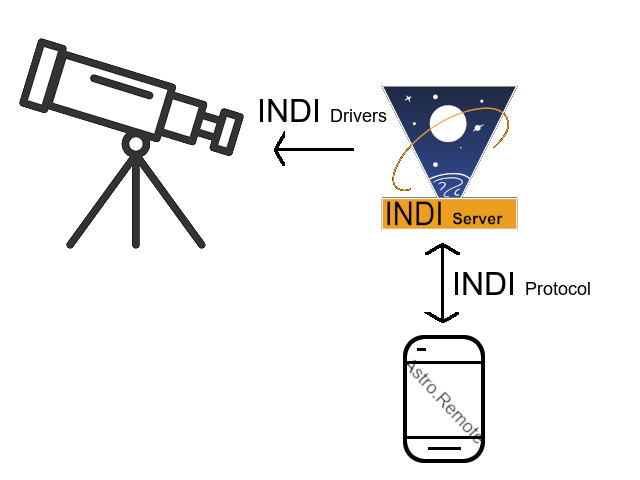

# About
Qkmaxware.Astro.Remote is a cross-platform client application for controlling telescopes using the INDI protocol. Using INDI this application can interface with a large variety of telescopes from different manufacturers. Usage of this application will require an INDI server to be connected to your telescope of choice. 

# Device Setup
To use Astro.Remote, you are required to have the following items.
1. Telescope with USB connection
2. INDI server
   1. [Astroberry](https://www.astroberry.io/) or otherwise
3. Device running Astro.Remote on the same network as the INDI server

